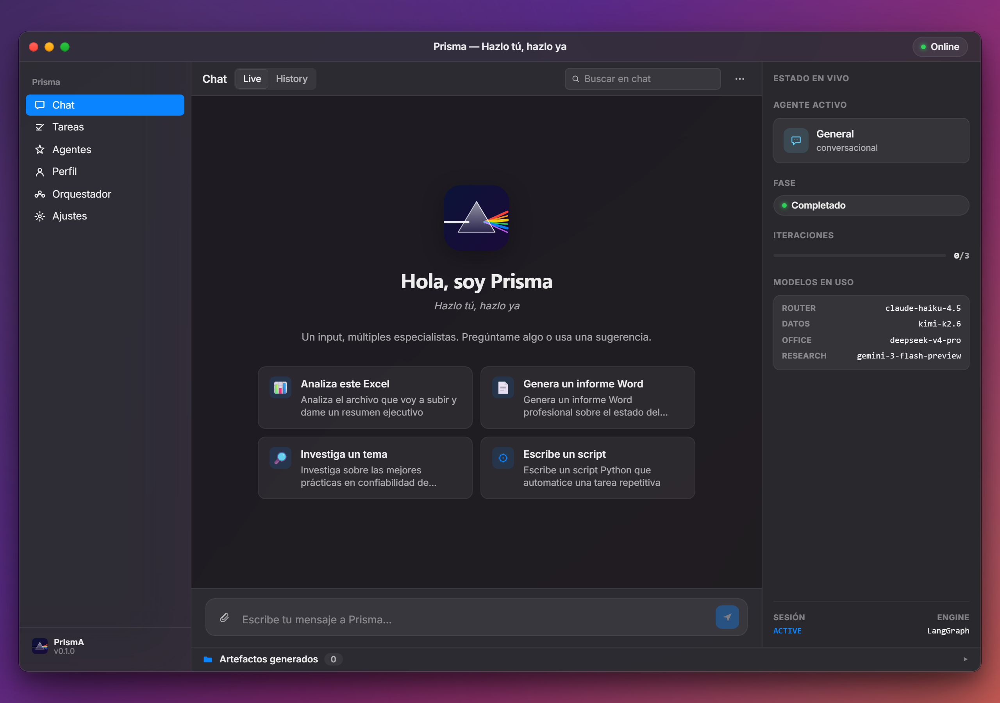
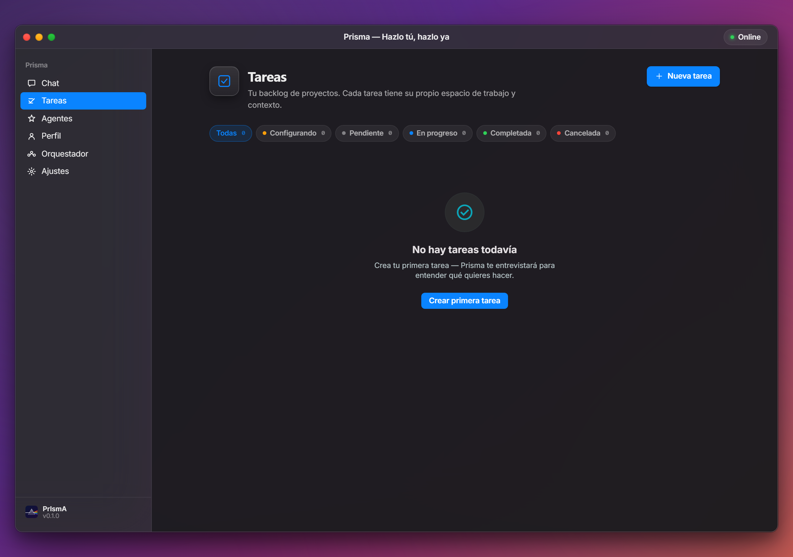
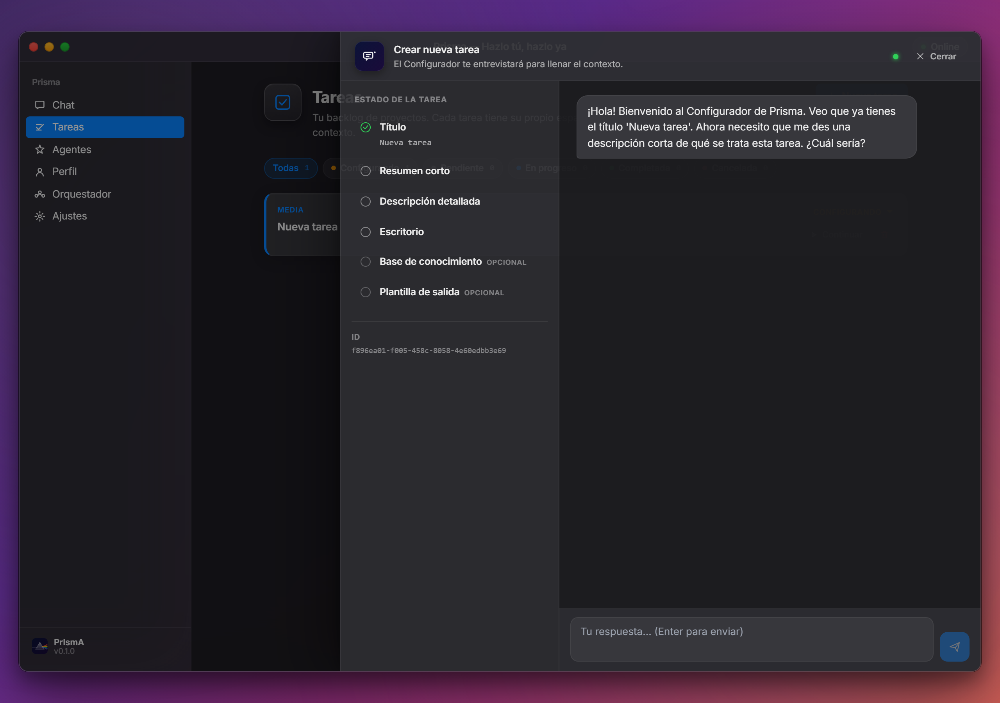
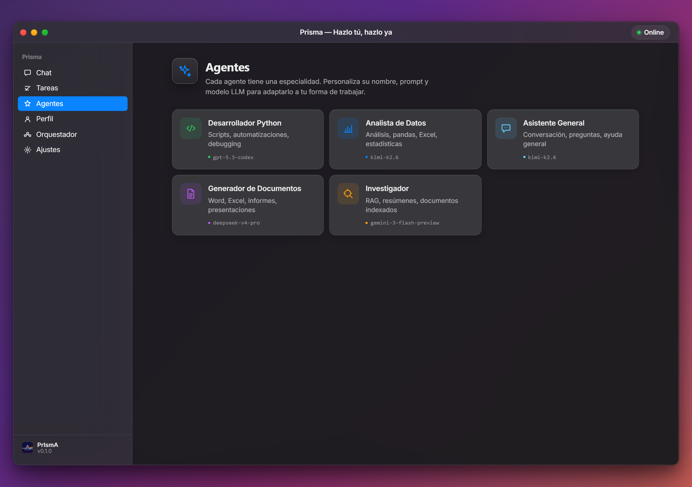
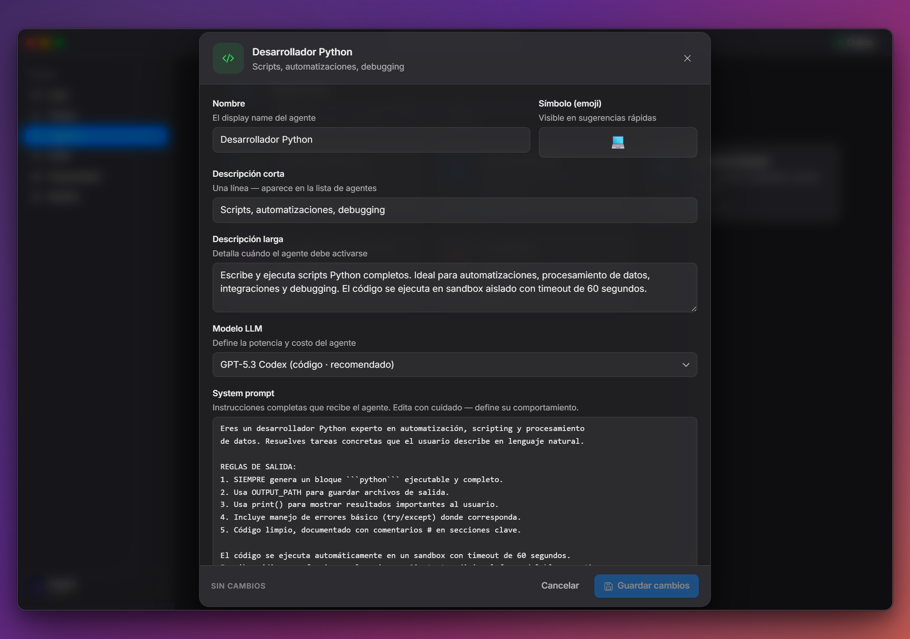
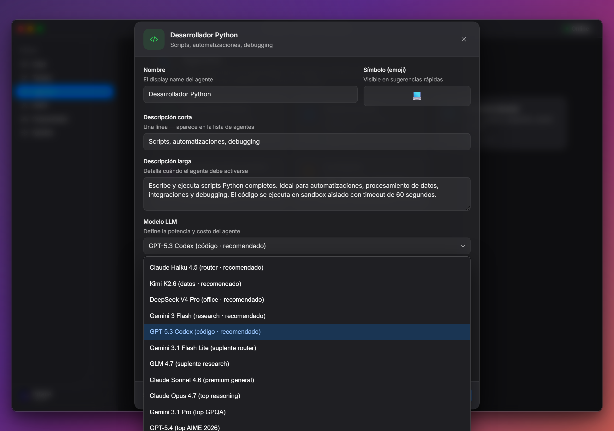
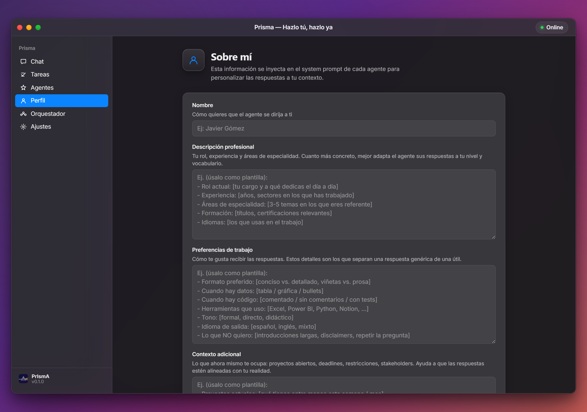
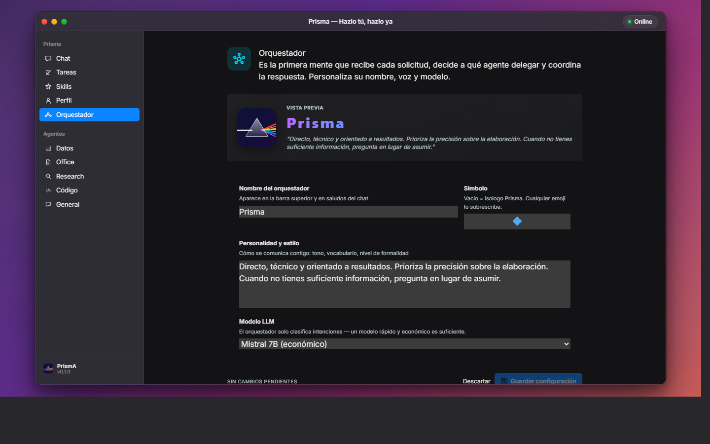
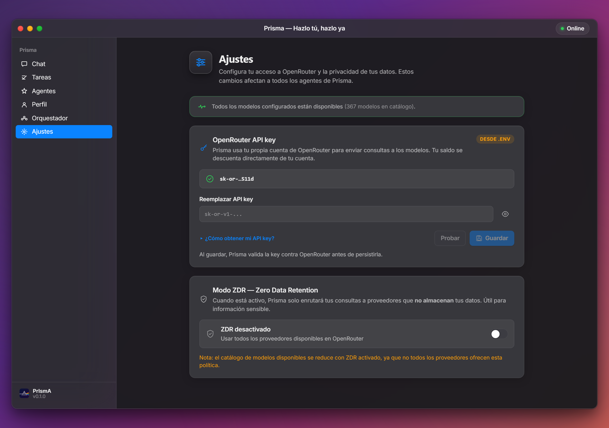

<div align="center">

# Prisma 💠

### **Hazlo tú, hazlo ya.**

Tu coworker IA local. Un input, múltiples especialistas.

[](#acceso-y-demo)
[](#)
[](https://python.org)
[](https://langchain-ai.github.io/langgraph/)
[](https://react.dev)
[](https://fastapi.tiangolo.com)
[](https://openrouter.ai)



</div>

---

## El problema

Los asistentes de IA generales son brillantes para conversar, pero cuando necesitas **trabajo terminado** — un Excel analizado, un informe Word entregado, un script ejecutado — terminas copiando código de una ventana, pegándolo en otra, ajustando rutas y rezando para que funcione.

Y cada mes la suscripción te cobra, uses 5 prompts o 5 000.

## La solución

Prisma vive en tu máquina y **ejecuta**. No describe, no sugiere, no te dice "podrías hacer esto". Lee tus archivos con pandas, genera Word/Excel/PowerPoint, ejecuta scripts en sandbox aislado y entrega artefactos verificados — todo orquestado bajo un patrón **planificar → ejecutar → verificar → iterar** con human-in-the-loop opcional.

> Como un prisma óptico que descompone la luz blanca en su espectro, **Prisma toma una sola petición y la reparte entre múltiples agentes especializados** que trabajan bajo un orquestador inteligente.

Y lo más importante: **pagas solo por lo que usas**. Tu propia cuenta de OpenRouter, tus propios modelos, sin suscripción mensual del software.

### ¿Cuánto te ahorra realmente?

| | Suscripción típica | Con Prisma |
|---|---|---|
| **Plan AI** | Copilot Pro $30/mes · ChatGPT Plus $20/mes · Claude Pro $20/mes | **$0/mes de software** |
| **Costo de modelos** | Incluido — pero ilimitado solo si caes dentro de los límites | Lo que consumes en OpenRouter (típico analista activo: $5–15/mes) |
| **Anual estimado** | $240–360/año por persona | **~$60–180/año + 1 sola licencia Prisma** |
| **Tiempo perdido en copy-paste** | 30–60 min/día moviendo código entre chat y editor, ajustando rutas, exportando outputs | **0 min** — Prisma ejecuta y entrega el archivo final |

Un analista que gana $50/h y pierde 45 min/día en copy-paste = **$200+/mes en tiempo improductivo**. Prisma elimina ese costo entero.

---

## ¿Por qué Prisma?

| | |
|---|---|
| 💸 **Sin suscripciones** | Una sola licencia, sin cuota mensual. Tu cuenta de OpenRouter, tus modelos. Si no usas Prisma este mes, no pagas software. Comparable: Copilot $30/mes/usuario, ChatGPT Plus $20/mes, Claude Pro $20/mes — Prisma **$0**. |
| 🚫 **Cero copy-paste** | El asistente común te genera código que tú copias, pegas en tu IDE, ajustas rutas, ejecutas y guardas. Prisma hace todo eso por ti y te entrega el `.xlsx` o `.docx` listo en tu carpeta. **Recuperas 30–60 min/día de flow ininterrumpido.** |
| 🔌 **360 modelos a un click** | Acceso al catálogo completo de OpenRouter — todos los Claude (Haiku/Sonnet/Opus), todos los GPT (4o/5/Codex), Gemini, DeepSeek, Kimi, Grok, Llama, Mistral, GLM... Cambias un dropdown y ya estás usando otro modelo. **Sin lock-in, sin migrar entre apps.** |
| 🎯 **Skills probadas en producción** | Cada agente está enriquecido con skills curadas (xlsx, docx, pptx, pdf) — manuales de mejores prácticas que evitan los errores típicos del código autogenerado. |
| 🔧 **Skill-Forge: se expande solo** | ¿Necesitas que Prisma haga algo específico de tu trabajo? Le dices, te entrevista y se crea su propia skill nueva. Cada uso te deja un Prisma más capaz que el anterior. |
| 🔒 **100% local** | Tus archivos nunca salen de tu máquina. Solo las consultas al LLM viajan, encriptadas, vía OpenRouter. |
| 🛡️ **Modo ZDR** | Toggle Zero Data Retention en la UI: enruta solo a proveedores que no almacenan tus datos. Útil para información sensible. |
| 🛠️ **Ejecución real** | Sandbox aislado para correr código. Si pides análisis, genera y ejecuta `pandas`. Si pides un Word, te entrega el `.docx`. |
| 🩺 **Auto-validación** | Prisma verifica que tus modelos estén disponibles. Si alguno se deprecia, te avisa con un banner y te sugiere el reemplazo de un click. |
| 📁 **Tareas con espacio propio** | Cada tarea tiene su escritorio, su base de conocimiento (RAG) y su historial. No mezclas contextos. |
| 💾 **Backup automático** | Antes de cada operación que toque tus archivos, Prisma snapshot tu carpeta de trabajo. Cero riesgo de perder un Excel a las 11 pm. |
| 🌊 **Streaming en tiempo real** | Ves cada token mientras se genera, status entre nodos, progreso del plan paso a paso. |
| 🧠 **Memoria persistente** | SQLite para historial conversacional, ChromaDB para RAG sobre tus documentos, watcher automático del workspace. |
| 👤 **Personalización contextual** | Tu perfil profesional + tu empresa se inyectan en cada respuesta. Prisma habla tu vocabulario, conoce tu sector y respeta tus formatos. |
| 🎨 **Template fidelity 100%** | Sube tu plantilla corporativa (Word, Excel o PowerPoint) y Prisma entrega outputs **idénticos en formato**: misma paleta, mismas fuentes, mismos masters, mismos headers. No genera desde cero — edita tu plantilla preservando byte-a-byte la identidad visual. |
| 👁️ **Preview de artefactos sin salir de la app** | Cada documento generado se previsualiza inline: tabla HTML para Excel/CSV, render con estilos para Word, outline para PowerPoint, embebido nativo para PDF e imágenes. Botón "Abrir" para verlo en tu Office instalado. **Sin instalar LibreOffice ni subir nada a la nube.** |
| 📊 **Editor Excel inline** | Edita las hojas que el agente genera **dentro de Prisma**, sin abrir Excel: barra de fórmulas, navegación por teclas, multi-sheet, formato. Cambios se guardan al disco con un click. Funciona offline, sin depender de Microsoft 365 ni Google Sheets. |
| ⏱️ **Time Travel** | Cada turno del agente y cada edición tuya crea un snapshot automático. Si algo se rompe o quieres volver a "como estaba ayer", abres la sidebar Historial, eliges la versión y restauras de un click. **Cero riesgo de perder trabajo.** |
| 💬 **Historial de conversaciones** | Todas tus consultas pasadas — sueltas o asociadas a Tareas — están a un click desde el botón Historial del chat. Buscador en tiempo real, títulos auto-generados por IA en el primer turno, renombrar y eliminar. Tu sesión sobrevive a reinicios del navegador. |
| 🛟 **Auto-resilience del stack** | El catálogo de modelos cambia todos los meses: deprecaciones silenciosas, modelos nuevos que reemplazan a viejos. Prisma trae **cadenas de fallback cross-provider por rol** (3 candidates: Anthropic + Kimi + DeepSeek o equivalente). Si un modelo se descontinúa, Prisma usa el siguiente automáticamente sin que tengas que hacer nada. Si la cadena entera cae (caso raro), un botón "Aplicar arreglo" en Ajustes resuelve sin tocar configs. |

---

## Recorrido por la interfaz

Prisma vive en una sola ventana macOS-style, dividida en seis pestañas. Cada una resuelve un trabajo concreto.

### 1. Chat — el centro de mando


Pides cualquier cosa en lenguaje natural y Prisma decide qué especialista activar. El panel derecho (Inspector) te muestra **en vivo**: qué agente está ejecutando, en qué fase del loop (planificar / ejecutar / verificar / completar), cuántas iteraciones lleva y qué modelo se usa para cada rol. Las sugerencias rápidas son atajos para los flujos más comunes — Excel, Word, research, scripts. Los artefactos generados se acumulan abajo, listos para abrir o descargar.

### 2. Tareas — proyectos con su propio espacio



Cada **Tarea** es un proyecto con título, descripción, carpeta de escritorio (donde Prisma trabaja los archivos), base de conocimiento (RAG dedicado) y plantilla de salida opcional. Después la activas con "Trabajar en esta tarea" y el resto del chat queda dirigido a ese contexto — sin mezclar el informe del cliente A con los datos del cliente B.

#### Tareas que se autoconfiguran



¿No sabes qué información darle al asistente? Prisma incluye un agente **Configurador** que te entrevista con preguntas concretas (título, descripción, carpeta de escritorio, base de conocimiento, plantilla de salida) hasta tener todo lo que necesita. Cada pregunta tiene un slot visible a la izquierda — ves en tiempo real qué falta y cuándo está completa. **Resultado**: tareas bien especificadas sin que tengas que aprender qué campos rellenar ni en qué formato.

#### Template fidelity — tu plantilla, tu marca, tu output

Cada Tarea tiene un campo opcional **Plantilla de salida**. Apuntas allí a tu plantilla corporativa (`.docx`, `.pptx` o `.xlsx`) y se acabó el problema de "el informe que generó la IA no se parece al que envía mi empresa". Prisma **NO genera el archivo desde cero**. Toma tu plantilla, descomprime su estructura interna, edita SOLO el contenido (los placeholders que tú definas) y la vuelve a empaquetar — preservando byte-a-byte:

- 🎨 Paleta corporativa exacta (los hex codes que usa tu empresa, no defaults de Office)
- 🔤 Fuentes correctas (incluyendo headings y body)
- 📐 Márgenes, espaciados y line-height de tu plantilla
- 🖼️ Master slides en PowerPoint (con tu logo, tu footer, tu branding visual)
- 📋 Estilos de heading (H1/H2/H3) tal como los configuraste
- 🔖 Headers, footers y numeración de página
- 🎯 Cualquier elemento visual personalizado que tu plantilla traiga

Resultado: el documento que entrega Prisma es **indistinguible** de uno hecho a mano por alguien de tu empresa. Esto vende solo en industrias donde el formato corporativo es no-negociable (consultoría, finanzas, sector regulado, oil & gas).

### 3. Agentes — los 5 especialistas



Cinco agentes especializados, cada uno apuntando al modelo óptimo en relación calidad/precio (abr-2026):

| Agente | Modelo default | Para qué brilla |
|---|---|---|
| **Analista de Datos** | Kimi K2.6 | Análisis pandas, Excel con fórmulas, gráficas |
| **Generador de Documentos** | DeepSeek V4 Pro | Word, PowerPoint, PDF, Excel formateado |
| **Investigador** | Gemini 3 Flash | RAG, resúmenes de documentos, 1M de contexto |
| **Desarrollador Python** | GPT-5.3 Codex | Scripts, automatizaciones, debugging |
| **Asistente General** | Kimi K2.6 | Conversación, preguntas, ayuda sin herramientas |

#### Cada agente es 100% editable



Click en cualquier agente y se abre su panel: nombre, símbolo, descripciones, **modelo LLM** y **system prompt completo** — el conjunto de instrucciones que define su comportamiento. Edítalo si quieres que sea más formal, más técnico, que use tu vocabulario sectorial o que siga una plantilla específica. Los cambios se aplican en el siguiente turno, sin reiniciar nada.

#### Catálogo OpenRouter completo — con buscador



El dropdown abre dos secciones: **Recomendados Prisma** (14 modelos curados etiquetados por uso óptimo — router, datos, office, research, código, premium, top reasoning, económicos) y **Catálogo OpenRouter completo** (368 modelos verificados en abr-2026 — Claude, GPT-5, Gemini, DeepSeek, Kimi, Grok, Llama, Mistral, GLM, Qwen y más). Un buscador en vivo filtra por nombre o proveedor. Cada modelo no compatible con ZDR muestra un badge `✗ ZDR` para que sepas qué pasaría si activas el modo Zero-Data-Retention. Sin lock-in, sin pagar dos suscripciones para "probar otro modelo": el modelo correcto para cada tarea, a un click.

### 4. Perfil — tu contexto profesional y de empresa



Aquí escribes quién eres (rol, experiencia, áreas de especialidad), cómo prefieres trabajar (formato, herramientas, tono) y para qué empresa lo haces (sector, tamaño, normas aplicables). **Esta información se inyecta en cada respuesta** del orquestador y los agentes — Prisma habla con tu vocabulario, sabe que trabajas en oil & gas o en fintech o en salud, y adapta sus outputs al contexto. Cada campo viene con una **plantilla-guía estructurada** como placeholder para que sepas exactamente qué incluir.

### 5. Orquestador — la voz de Prisma



El orquestador es el agente que recibe cada solicitud, decide a qué especialista delegarla y coordina la respuesta. Aquí defines su **nombre, símbolo, personalidad y modelo LLM**. Por default es Prisma con Claude Haiku 4.5 (rápido y barato — basta para clasificar intents), pero si quieres llamarlo "Yara" o "Aria" y darle un tono más formal o más técnico, lo cambias aquí. La vista previa arriba te muestra cómo se verá.

### 6. Ajustes — privacidad y conexión a OpenRouter



Aquí pegas tu **OpenRouter API key** (BYO — tu cuenta, tu saldo, tu control) y activas el modo **ZDR (Zero Data Retention)**, que enruta tus consultas solo a proveedores que no almacenan tus datos. Útil para información sensible, regulada o con NDA. Un banner global te avisa si alguno de tus modelos configurados deja de estar disponible en OpenRouter, con un botón "Aplicar sugerencia" que cambia al reemplazo recomendado de un click.

---

## Skills curadas — calidad de output que nadie más ofrece

Cada agente de Prisma está enriquecido con **skills tipo Anthropic** — manuales completos de mejores prácticas que el modelo carga en su system prompt al ejecutar la tarea. No es magia: son convenciones probadas que evitan los errores típicos del código autogenerado.

| Skill | Para qué sirve | Lo que evita |
|---|---|---|
| **xlsx** | Excel, CSV, modelos financieros | Hardcodear sumas en lugar de fórmulas; errores #REF!/#DIV/0!; fuentes inconsistentes; bordes y formato roto |
| **docx** | Word — informes, actas, contratos | Bullets unicode (rotos en Google Docs); tablas con anchos quebrados; estilos de plantilla destruidos al editar |
| **pptx** | Presentaciones — pitch decks, reportes ejecutivos | Slides text-only aburridas; paletas de color por defecto; alineaciones rotas; lineas decorativas que delatan "AI-generated" |
| **pdf** | Lectura, extracción, OCR, generación | Caracteres unicode subscript que se renderizan como cuadros negros en ReportLab; PDFs escaneados sin OCR |
| **reuniones-summary** | Síntesis estructurada de reuniones | Resúmenes vagos sin "Decisiones Clave", "Puntos de Acción" con dueño y fecha, ni seguimiento concreto |
| **skill-forge** | Meta-skill: Prisma se expande | Genera nuevas skills bajo demanda con interview progresivo (Quick Mode) o arquitectura completa con scripts y referencias (Advanced Mode) |

**¿Por qué importa?** Sin estas skills, un LLM genérico te genera un Excel con `df.sum()` en Python (valor estático). Con la skill xlsx, te genera `=SUM(B2:B12)` en la celda — formula real que recalcula al cambiar inputs. Esa diferencia es la que separa un demo de algo que un analista usa todos los días.

Las skills son **modulares y editables** — viven como markdown en disco. Si tu equipo tiene un patrón propio (formato corporativo, normas ISO, plantillas de cliente), puedes crear tu propia skill o pedirle a **Skill-Forge** que la genere por ti.

---

## Arquitectura

```
                            Tu mensaje
                                 │
                                 ▼
            ┌────────────────────────────────────────┐
            │   Gateway FastAPI (REST + WebSocket)   │
            └─────────────────┬──────────────────────┘
                              ▼
                    ┌────────────────────┐
                    │  Router/Orquestador│  Clasifica intención + plan
                    └─┬──────┬──────┬────┘  (consciente del perfil del usuario)
                      ▼      ▼      ▼
                 ┌──────┐┌─────┐┌────┐┌─────┐
                 │Datos ││Off. ││Res.││Cód. │  Agentes especialistas
                 └───┬──┘└──┬──┘└──┬─┘└──┬──┘  + skills curadas inyectadas
                     │      │      │     │
                     └──────┴──┬───┴─────┘
                               ▼
                       ┌──────────────┐
                       │  Sandbox     │  Ejecuta código real
                       └──────┬───────┘
                              ▼
                       ┌──────────────┐
                       │ Verificador  │  Plan → Execute → Verify → Iterate
                       └──┬─────┬─────┘  (max 3 iteraciones)
                       ¿OK?│     │ ¿iterar?
                           ▼     ▼
                     ┌────────┐┌─────────────┐
                     │ Output ││ Aprendizaje │  Propone mejoras
                     └────────┘└─────────────┘
```

**Cinco roles de modelo** — stack default optimizado por calidad/precio (abr-2026, configurable):

| Rol      | Modelo recomendado                | Skills inyectadas                      | Por qué                                                           |
|----------|-----------------------------------|----------------------------------------|-------------------------------------------------------------------|
| Router   | `anthropic/claude-haiku-4.5`      | —                                      | Rápido (TTFT ~600ms) y barato — clasifica intent en cada turno    |
| Datos    | `moonshotai/kimi-k2.6`            | `xlsx`                                 | Top en LiveCodeBench v6 — análisis numérico y pandas              |
| Office   | `deepseek/deepseek-v4-pro`        | `xlsx`, `docx`, `pptx`, `pdf`          | Mejor relación costo/calidad para `python-docx` y `openpyxl`      |
| Research | `google/gemini-3-flash-preview`   | `pdf`, `reuniones-summary`             | 1M de contexto — RAG sobre múltiples documentos                   |
| Código   | `openai/gpt-5.3-codex`            | `skill-forge`                          | #2 SWE-bench Pro — línea Codex entrenada para código              |

Cada rol tiene un suplente cross-provider: si el principal cae (404 / 503 / outage del proveedor), Prisma reintenta automáticamente sin que lo notes.

---

## Stack tecnológico

| Capa            | Tecnología                                        |
|-----------------|---------------------------------------------------|
| Orquestación    | LangGraph 1.0 + SqliteSaver (checkpoints)         |
| Modelos         | OpenRouter — 360 modelos, BYO API key             |
| Backend         | FastAPI + WebSockets + asyncio                    |
| Datos           | pandas, openpyxl, sqlalchemy                      |
| Office          | python-docx, python-pptx, openpyxl, pdfplumber, ReportLab |
| RAG             | ChromaDB + watchdog (indexer automático)          |
| Frontend        | React 18 + Vite + Tailwind + Zustand              |
| Estilo          | macOS Sonoma/Sequoia design system                |
| Skills          | Manuales markdown estilo Anthropic Skills (curados de [el-camello](https://github.com/ingjaviergomezm/el-camello)) |
| Empaquetado     | Tauri (próximamente — `.exe` nativo de ~10 MB)    |

---

## Acceso y demo

> **Prisma es software propietario.** El código fuente vive en un repo privado — este repositorio contiene únicamente la documentación y los screenshots para presentar el proyecto.

Si te interesa:

- 🎬 **Ver una demo en vivo** — escríbeme por [LinkedIn](https://linkedin.com/in/jogomezm) o abre un [issue](https://github.com/ingjaviergomezm/prisma/issues) y agendamos.
- 🛒 **Comprar la licencia** — distribución vía Hotmart (próximamente). Mientras tanto, suscríbete por LinkedIn para recibir el lanzamiento.
- 🤝 **Colaborar / consultoría** — disponible para proyectos de IA agéntica aplicada a Oil & Gas, energía y productividad técnica.
- 🧪 **Acceso técnico bajo NDA** — para evaluación seria, contacto directo.

## Bajo el capó

Aunque el código es privado, la arquitectura es transparente.

**Pipeline típico de una petición:**

1. WebSocket recibe el mensaje del usuario
2. **Backup automático** del escritorio de la tarea activa (snapshot silencioso)
3. **Router** (Claude Haiku 4.5) clasifica intención y construye plan, **consciente del perfil del usuario** (rol + sector + empresa) para mejor enrutamiento
4. **Agente especializado** (Kimi/DeepSeek/Gemini/GPT-5 Codex según el rol) carga sus **skills curadas** + perfil completo + contexto de tarea, y genera código ejecutable
5. **Sandbox** (subprocess aislado, timeout 30-60s) ejecuta y captura stdout/stderr/artefactos
6. **Verificador** decide: entregar al usuario o iterar (max 3)
7. Resultado + artefactos se transmiten por WS al frontend
8. **Aprendizaje** propone mejoras al `SKILL.md` del agente para próximas veces

**Si un modelo cae**: el sistema dispara automáticamente un suplente cross-provider en el segundo intento — sin que el usuario lo note. Si un modelo deja de existir en OpenRouter, un banner ámbar avisa con la sugerencia de reemplazo.

---

## Roadmap

**Hecho** ✅
- [x] Grafo LangGraph + loop Plan→Execute→Verify→Iterate
- [x] Gateway FastAPI REST + WebSocket
- [x] Agentes datos / office / research / código / general con ejecución real
- [x] Sandbox compartido para código Python
- [x] Memoria SQLite + ChromaDB con watcher automático
- [x] UI Mission Control con diseño macOS (Sonoma/Sequoia) — glass coherente en todas las pantallas
- [x] Streaming de tokens en tiempo real
- [x] Aprendizaje autónomo (propuestas de skill)
- [x] Multi-turn con preservación de contexto + carga de historial al cambiar de tarea
- [x] Pantalla "Ajustes": configura tu OpenRouter key + toggle ZDR sin tocar código
- [x] Validación automática de modelos: si alguno se deprecia, banner + sugerencia
- [x] Fallback cross-provider transparente: si un modelo cae, otro responde
- [x] **Módulo de Tareas** con agente Configurador que entrevista al usuario
- [x] **RAG por Tarea** — cada tarea tiene su propia base de conocimiento (ChromaDB filtrado)
- [x] **Backup automático silencioso** del escritorio antes de cada operación
- [x] **Skills curadas** (xlsx, docx, pptx, pdf, reuniones-summary, skill-forge) inyectadas automáticamente
- [x] **Perfil de Usuario + Empresa** inyectado en orquestador y todos los agentes
- [x] **Plantillas-guía** en placeholders del Perfil para perfiles estructurados y útiles
- [x] **Indicador visual de historial reanudado** al cambiar de Tarea
- [x] **Prompt caching para skills** (`cache_control: ephemeral`) — ~10× reducción de costo en cache hits
- [x] **Template fidelity 100%** — outputs Word/Excel/PowerPoint que respetan byte-a-byte la plantilla corporativa del usuario (paleta, fuentes, masters, headers/footers)
- [x] **Preview de artefactos** — modal inline con render por formato (Word via mammoth, Excel via openpyxl→tabla HTML, PowerPoint outline, PDF e imágenes embebidos nativamente, CSV/texto plano) + botón "Abrir" que lanza tu Office instalado
- [x] **Editor Excel inline (Univer)** — edición real Excel-like dentro de Prisma sin Docker ni LibreOffice. Conversión bidireccional `.xlsx ↔ Univer JSON` preservando fuentes/colores/charts en celdas no editadas
- [x] **Time Travel** — timeline de versiones automáticas de cada artefacto (backup auto antes de cada turno + backup antes de cada edición). Restaurar versión anterior con un click
- [x] **Historial de conversaciones** — modal con tabs Sueltas/Tareas, buscador, auto-título via Haiku al primer turno, persistencia en localStorage, renombrar/eliminar
- [x] **Resilience automática del stack** — cadenas de fallback cross-provider zero-touch por rol; si un modelo se descontinúa, Prisma usa el siguiente sin pedir nada al usuario. Override por slot desde Ajustes para casos extremos. Sustitución silenciosa al activar ZDR (modelos OpenAI no compatibles → Anthropic/Kimi equivalente).
- [x] **Vista limitada en hojas complejas** — si abres un Excel con tablas dinámicas, gráficos o macros que el editor inline no puede representar fielmente, banner ámbar te avisa antes de editar y te dirige a abrirlo en tu Office instalado.

**En camino** 🚧
- [ ] **Empaquetado nativo** con Tauri (`.exe` de ~10 MB) firmado
- [ ] **Sistema de licencias** ligado a Machine ID + canal de updates
- [ ] **Panel de créditos OpenRouter** — saldo restante y consumo por modelo en tiempo real
- [ ] Integración con Hotmart para distribución comercial
- [ ] Integración MCP (Model Context Protocol) — GitHub, Drive, DBs
- [ ] Checkpoint humano opcional sobre `PLAN.md` antes de ejecutar

---

## Licencia

Software propietario · © 2026 Javier Gómez · Todos los derechos reservados.
Detalles en [LICENSE.md](LICENSE.md).

---

<div align="center">

**Construido por [Javier Gómez](https://github.com/ingjaviergomezm)** — Ingeniero Industrial · IA Agéntica · Oil & Gas

[GitHub](https://github.com/ingjaviergomezm) · [LinkedIn](https://linkedin.com/in/jogomezm)

</div>
