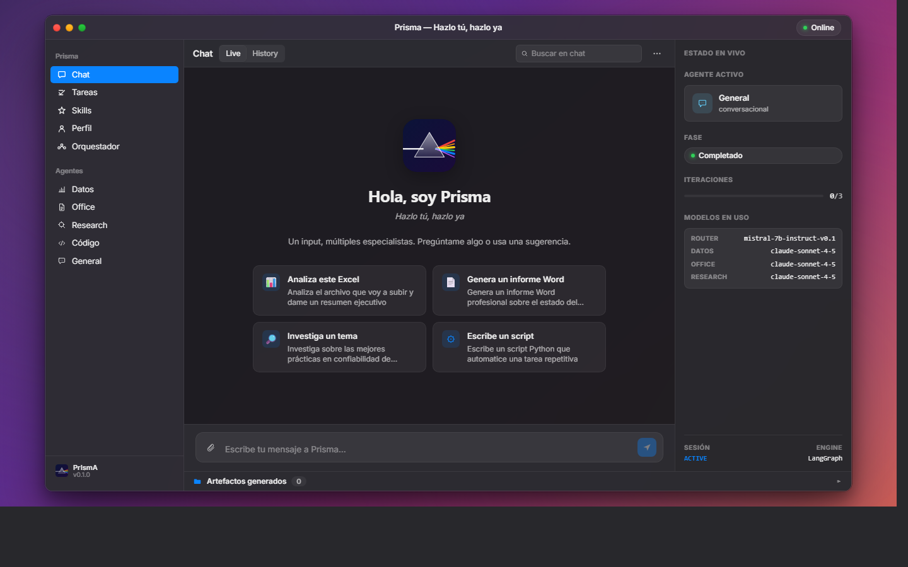
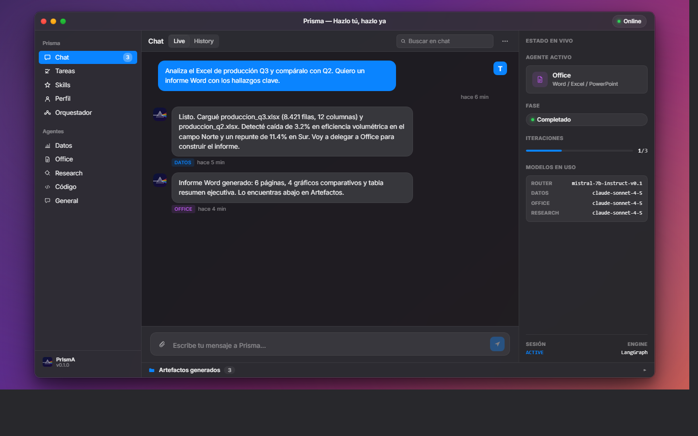
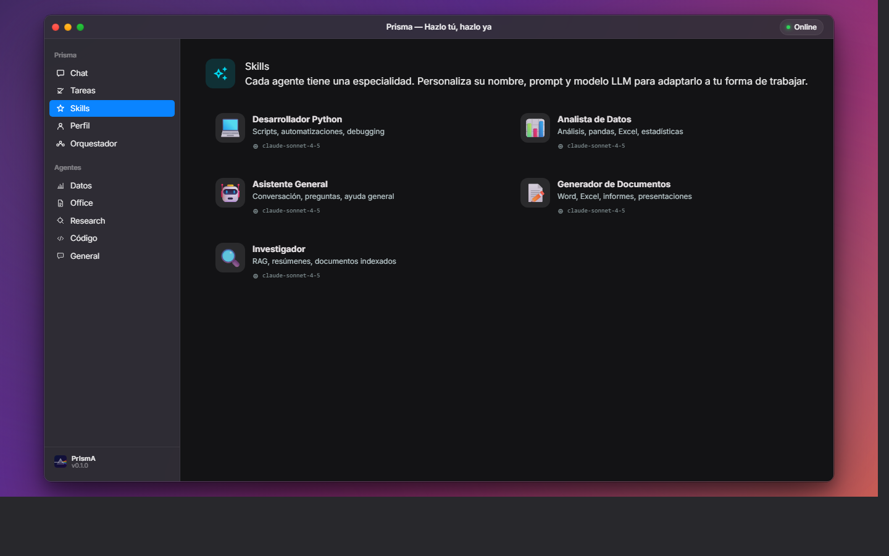
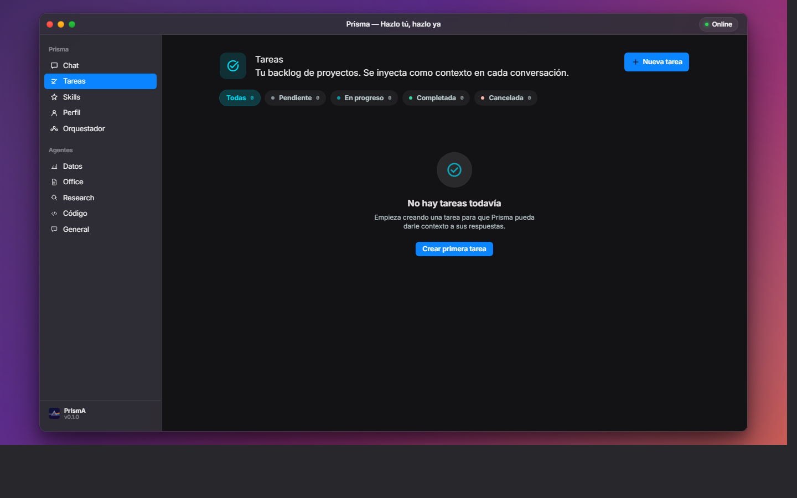

<div align="center">

# Prisma 💠

### **Hazlo tú, hazlo ya.**

Tu coworker IA local. Un input, múltiples especialistas.

[](#acceso-y-demo)
[](#)
[](https://python.org)
[](https://langchain-ai.github.io/langgraph/)
[](https://react.dev)
[](https://fastapi.tiangolo.com)
[](https://openrouter.ai)



</div>

---

## El problema

Los asistentes de IA generales son brillantes para conversar, pero cuando necesitas **trabajo terminado** — un Excel analizado, un informe Word entregado, un script ejecutado — terminas copiando código de una ventana, pegándolo en otra, ajustando rutas y rezando para que funcione.

## La solución

Prisma vive en tu máquina y **ejecuta**. No describe, no sugiere, no te dice "podrías hacer esto". Lee tus archivos con pandas, genera Word/Excel/PowerPoint con python-docx/openpyxl/python-pptx, ejecuta scripts en sandbox aislado, y entrega artefactos verificados — todo orquestado bajo un patrón de **planificar → ejecutar → verificar → iterar** con human-in-the-loop opcional.

> Como un prisma óptico que descompone la luz blanca en su espectro, **Prisma toma una sola petición y la reparte entre múltiples agentes especializados** que trabajan en paralelo bajo un orquestador inteligente.

---

## ¿Por qué Prisma?

| | |
|---|---|
| 🔒 **100% local** | Tus datos nunca salen de tu máquina. Solo las consultas al LLM viajan, encriptadas, vía OpenRouter. |
| 🛠️ **Ejecución real** | Sandbox aislado para correr código. Si pides análisis, genera y ejecuta `pandas`. Si pides un Word, te entrega el `.docx`. |
| 🔌 **Multi-modelo** | Sin lock-in. Claude para razonar, Mistral para clasificar, Gemini para research — el modelo correcto para cada tarea. |
| 🌊 **Streaming en tiempo real** | Ves cada token mientras se genera, status entre nodos, progreso del plan paso a paso. |
| 🧠 **Memoria persistente** | SQLite para historial conversacional, ChromaDB para RAG sobre tus documentos, watcher automático del workspace. |
| 📚 **Aprende de cada uso** | Después de cada tarea exitosa, propone mejoras a sus skills que tú apruebas con un click. |

---

## Galería

### Estado en vivo: orquestador, plan, agente activo, modelos por rol



El panel derecho (Inspector) muestra qué agente está ejecutando, en qué fase del loop (planificar/ejecutar/verificar/completar), cuántas iteraciones lleva, y qué modelo se está usando para cada rol. La conversación muestra al agente Datos pasándole el control al agente Office tras analizar el Excel.

### Skills personalizables: cada agente con su propio prompt y modelo LLM



Cada agente es un *skill* editable: nombre, avatar, descripción corta, prompt completo y modelo. Activas/desactivas, ajustas la personalidad, y Prisma propone mejoras automáticamente después de cada ejecución exitosa.

### Tareas: contexto persistente en cada conversación



Las tareas activas se inyectan automáticamente en el contexto del orquestador. Cuando le pides algo a Prisma, ya sabe en qué proyectos estás trabajando, qué está en progreso y qué es crítico.

### Orquestador configurable: tu IA, tu personalidad


Define el nombre, emoji, tono y modelo del orquestador (el agente que clasifica y delega). Cambia su personalidad sin tocar código.

---

## Arquitectura

```
                            Tu mensaje
                                 │
                                 ▼
            ┌────────────────────────────────────────┐
            │   Gateway FastAPI (REST + WebSocket)   │
            └─────────────────┬──────────────────────┘
                              ▼
                    ┌────────────────────┐
                    │   Router (Mistral) │  Clasifica intención + plan
                    └─┬──────┬──────┬────┘
                      ▼      ▼      ▼
                 ┌──────┐┌─────┐┌────┐┌─────┐
                 │Datos ││Off. ││Res.││Cód. │  Agentes especialistas
                 └───┬──┘└──┬──┘└──┬─┘└──┬──┘  (modelo potente)
                     │      │      │     │
                     └──────┴──┬───┴─────┘
                               ▼
                       ┌──────────────┐
                       │  Sandbox     │  Ejecuta código real
                       └──────┬───────┘
                              ▼
                       ┌──────────────┐
                       │ Verificador  │  Plan → Exec → Verify → Iterate
                       └──┬─────┬─────┘  (max 3 iteraciones)
                       ¿OK?│     │ ¿iterar?
                           ▼     ▼
                     ┌────────┐┌─────────────┐
                     │ Output ││ Aprendizaje │  Propone mejoras
                     └────────┘└─────────────┘
```

**Cinco roles de modelo** (configurables vía `.env`):

| Rol           | Modelo recomendado            | Por qué                        |
|---------------|-------------------------------|--------------------------------|
| Router        | `mistralai/mistral-7b`        | Rápido + barato para clasificar |
| Datos         | `anthropic/claude-sonnet-4.5` | Razonamiento numérico fuerte    |
| Office        | `anthropic/claude-sonnet-4.5` | Generación de código robusto    |
| Research      | `google/gemini-2.5-pro`       | Contexto largo + búsqueda web   |
| Verificador   | `anthropic/claude-haiku`      | Veredicto rápido                |

---

## Stack tecnológico

| Capa            | Tecnología                                        |
|-----------------|---------------------------------------------------|
| Orquestación    | LangGraph 1.0 + SqliteSaver (checkpoints)         |
| Modelos         | OpenRouter (Claude, Gemini, Mistral, Llama, ...)  |
| Backend         | FastAPI + WebSockets + asyncio                    |
| Datos           | pandas, openpyxl, sqlalchemy                      |
| Office          | python-docx, python-pptx, openpyxl                |
| RAG             | ChromaDB + watchdog (indexer automático)          |
| Frontend        | React 18 + Vite + Tailwind + Zustand              |
| Estilo          | macOS Sonoma/Sequoia design system                |
| CLI             | Typer + Rich + Loguru                             |
| Empaquetado     | Tauri (próximamente — `.exe` nativo de ~10 MB)    |

---

## Acceso y demo

> **Prisma es software propietario.** El código fuente no está disponible públicamente — este repositorio contiene únicamente la documentación y los screenshots para presentar el proyecto.

Si te interesa:

- 🎬 **Ver una demo en vivo** — escríbeme por [LinkedIn](https://linkedin.com/in/jogomezm) o abre un [issue](https://github.com/ingjaviergomezm/prisma/issues) y agendamos.
- 🤝 **Colaborar / consultoría** — disponible para proyectos de IA agéntica aplicada a Oil & Gas, energía y productividad técnica.
- 🧪 **Acceso técnico bajo NDA** — para evaluación seria, contacto directo.

## Bajo el capó

Aunque el código es privado, la arquitectura es transparente.

**Pipeline típico de una petición:**

1. WebSocket recibe el mensaje del usuario
2. **Router** (Mistral 7B, ~50ms) clasifica intención y construye plan
3. **Agente especializado** (Claude Sonnet) genera código ejecutable
4. **Sandbox** (subprocess aislado, timeout 30-60s) ejecuta y captura stdout/stderr/artefactos
5. **Verificador** (Claude Haiku) decide: entregar al usuario o iterar (max 3)
6. Resultado + artefactos se transmiten por WS al frontend
7. **Aprendizaje** propone mejoras al `SKILL.md` del agente para próximas veces

**API expuesta** (cuando se obtiene acceso):

```bash
GET  /status                    # estado del sistema
POST /chat                      # mensaje sincrónico
POST /upload                    # archivo + indexación automática
WS   /ws/{session_id}           # streaming en tiempo real
```

---

## Roadmap

**Hecho** ✅
- [x] Grafo LangGraph + loop Plan→Execute→Verify→Iterate
- [x] Gateway FastAPI REST + WebSocket
- [x] Agentes datos/office/research/código/general con ejecución real
- [x] Sandbox compartido para código Python
- [x] Memoria SQLite + ChromaDB con watcher automático
- [x] UI Mission Control con diseño macOS (Sonoma/Sequoia)
- [x] Streaming de tokens en tiempo real
- [x] Aprendizaje autónomo (propuestas de skill)
- [x] Multi-turn con preservación de contexto

**En camino** 🚧
- [ ] Empaquetado nativo con Tauri (.exe de ~10 MB)
- [ ] Integración MCP (Model Context Protocol) — GitHub, Drive, DBs
- [ ] Checkpoint humano opcional sobre `PLAN.md` antes de ejecutar
- [ ] Skills adicionales: ISO 50001, ISO 14224, Power BI export
- [ ] Dashboard de métricas de agentes (latencia, costo, éxito)

---

## Licencia

Software propietario · © 2026 Javier Gómez · Todos los derechos reservados.
Detalles en [LICENSE.md](LICENSE.md).

---

<div align="center">

**Construido por [Javier Gómez](https://github.com/ingjaviergomezm)** — Ingeniero Industrial · IA Agéntica · Oil & Gas

[GitHub](https://github.com/ingjaviergomezm) · [LinkedIn](https://linkedin.com/in/jogomezm)

</div>
